# 🔬 Breast Cancer Histopathology Classification System

[](https://www.mathworks.com/products/matlab.html)
[](LICENSE)
[](https://www.kaggle.com/datasets/ambarish/breakhis)

<div align="center">

</div>
<br/>

A comprehensive **classical machine learning pipeline** for automated breast cancer histopathology image classification using traditional ML algorithms with advanced feature extraction and selection techniques.

---

## 📋 Table of Contents

- [Overview](#-overview)
- [Key Features](#-key-features)
- [Quick Start](#-quick-start)
- [System Requirements](#-system-requirements)
- [Workflow](#-workflow)
- [System Architecture](#-system-architecture)
- [Feature Engineering](#-feature-engineering)
- [Dataset](#-dataset)
- [GUI Application](#-gui-application)
- [File Structure](#-file-structure)
- [Dataset Bootstrap Examples](#-dataset-bootstrap-examples)
- [Results & Performance](#-results--performance)
- [Visualization Gallery](#-visualization-gallery)
- [License](#-license)
- [Author](#-author)
- [Acknowledgments](#-acknowledgments)
- [Project Status](#-project-status)
- [Contributing](#-contributing)

---

## 🎯 Overview

This project implements an **end-to-end 8-step pattern recognition pipeline** for binary classification of breast histopathology images (benign vs. malignant) using the **BreakHis dataset (100X magnification)**. 

### Performance Summary

| Model | Accuracy | Sensitivity | Specificity | AUC |
|-------|----------|-------------|-------------|-----|
| **Random Forest** | **70.1%** | 58.8% | 81.4% | 0.770 |
| **XGBoost** | 69.6% | 60.8% | 78.4% | 0.779 |
| **SVM (RBF+LDA)** | 64.4% | 62.9% | 66.0% | 0.661 |

*Patient-disjoint split: 85% train (1,078 images: Benign=531, Malignant=547) / 15% test (194 images: Benign=97, Malignant=97)*

---

## 🧠 Key Features

- **Fully automated workflow**: Dataset download → Training → GUI launch
- **Traditional ML focus**: SVM, Random Forest, XGBoost (no deep learning)
- **Advanced feature engineering**: 2767 features → 6 selection methods → optimal K=400
- **Comprehensive evaluation**: Cross-validation + statistical tests + 13 diagnostic figures
- **GUI for inference**: Automatic launch after training completion
- **Automated dataset bootstrap**: Fallback mirrors for automatic download
- **Robust preprocessing**: 10-stage pipeline with CLAHE, multi-scale filtering
- **Patient-disjoint split**: Zero data leakage with verified patient separation
- **Clean, reproducible execution**: Detailed logging and result storage

---

## ⚡ Quick Start

### Installation & Execution

**Option 1: Automatic Dataset Download (Recommended)**

```matlab
% 1. Clone/download this repository
% 2. Place both .m files in the same folder
% 3. Run in MATLAB:
BreastCancerHistopathological
```

The script will:
- ✅ Automatically download `archive.zip` from fallback mirrors
- ✅ Extract BreakHis dataset
- ✅ Train models and generate results
- ✅ Launch GUI automatically when complete

**Option 2: Manual Dataset Placement**

1. Download `archive.zip` from [Kaggle BreakHis](https://www.kaggle.com/datasets/ambarish/breakhis)
2. Place `archive.zip` next to `BreastCancerHistopathological.m`
3. Run: `BreastCancerHistopathological`

---

## 🖥️ System Requirements

### Software
- MATLAB **R2021b or newer** (recommended)
- Required Toolboxes:
  - Image Processing Toolbox
  - Computer Vision Toolbox
  - Statistics and Machine Learning Toolbox
  - Pattern Recognition Toolbox

### Hardware
- CPU-based execution (GPU not required)
- Minimum **8 GB RAM** recommended
- Approximately **4 GB disk space** for dataset and intermediate files

### Operating System
- Windows (fully tested)
- Linux / macOS (expected to work with minor path adjustments)

---

## 🔄 Workflow

### Automated Execution Steps

```
┌─────────────────────────────────────┐
│ 1. Dataset Bootstrap                │
│    ├─ Check for archive.zip         │
│    ├─ Download from mirrors         │
│    ├─ Extract to BreakHis_Main/     │
│    └─ Resolve benign/malignant dirs │
└─────────────────────────────────────┘
                  ↓
┌─────────────────────────────────────┐
│ 2. Dataset Preparation              │
│    ├─ Patient-disjoint split        │
│    ├─ Balanced sampling             │
│    ├─ Train: 85% / Test: 15%       │
│    └─ Verify no data leakage        │
└─────────────────────────────────────┘
                  ↓
┌─────────────────────────────────────┐
│ 3. Feature Engineering              │
│    ├─ 10-stage preprocessing        │
│    ├─ Extract 2767 features         │
│    ├─ Feature selection (6 methods) │
│    └─ Dimensionality reduction      │
└─────────────────────────────────────┘
                  ↓
┌─────────────────────────────────────┐
│ 4. Model Training & Evaluation      │
│    ├─ 3-fold cross-validation       │
│    ├─ Hyperparameter grid search    │
│    ├─ Train: SVM, RF, XGBoost       │
│    └─ Test on held-out set          │
└─────────────────────────────────────┘
                  ↓
┌─────────────────────────────────────┐
│ 5. Output Generation                │
│    ├─ Save models.mat                │
│    ├─ Save results.mat               │
│    ├─ Generate 13 figures            │
│    └─ Write training_log.txt         │
└─────────────────────────────────────┘
                  ↓
┌─────────────────────────────────────┐
│ 6. GUI Launch (Automatic)           │
│    └─ breastCancerHistopathologyGui │
└─────────────────────────────────────┘
```

---

## 🏗️ System Architecture

### 8-Step Pattern Recognition Pipeline

```
┌─────────────────────────────────────────────────────────────┐
│ STEP 1: PROBLEM DEFINITION                                  │
│ - Binary classification (benign vs malignant)               │
│ - Clinical focus: Minimize false negatives                  │
└─────────────────────────────────────────────────────────────┘
                            ↓
┌─────────────────────────────────────────────────────────────┐
│ STEP 2: DATA ACQUISITION                                    │
│ - Load BreakHis dataset (100X magnification)                │
│ - Patient-disjoint split: 85% train / 15% test             │
│ - Data leakage verification                                 │
└─────────────────────────────────────────────────────────────┘
                            ↓
┌─────────────────────────────────────────────────────────────┐
│ STEP 3: PREPROCESSING (10 stages)                           │
│ - Grayscale → Resize → Denoise → CLAHE → Filter            │
│ - Sharpen → Morphology → Bilateral → Normalize             │
└─────────────────────────────────────────────────────────────┘
                            ↓
┌─────────────────────────────────────────────────────────────┐
│ STEP 4: FEATURE EXTRACTION (2767 features)                  │
│ - HOG, LBP, GLCM, Gabor (texture)                          │
│ - Edge, corner, shape (morphology)                         │
│ - Moments, percentiles, HSV (intensity)                    │
└─────────────────────────────────────────────────────────────┘
                            ↓
┌─────────────────────────────────────────────────────────────┐
│ STEP 5: FEATURE SELECTION (6 methods)                       │
│ - Variance/Correlation filtering → 2084 features           │
│ - ReliefF, F-Score, RFE, Tree, LASSO, PCA ranking          │
│ - Grid search: K ∈ {150, 300, 400}                         │
└─────────────────────────────────────────────────────────────┘
                            ↓
┌─────────────────────────────────────────────────────────────┐
│ STEP 6: MODEL SELECTION                                     │
│ - SVM (RBF kernel + LDA preprocessing)                     │
│ - Random Forest (ensemble of decision trees)               │
│ - XGBoost (gradient boosting)                              │
└─────────────────────────────────────────────────────────────┘
                            ↓
┌─────────────────────────────────────────────────────────────┐
│ STEP 7: TRAINING & HYPERPARAMETER TUNING                    │
│ - 3-fold stratified cross-validation                       │
│ - Grid search over hyperparameter space                    │
│ - Final training on full training set                      │
└─────────────────────────────────────────────────────────────┘
                            ↓
┌─────────────────────────────────────────────────────────────┐
│ STEP 8: EVALUATION (held-out test set)                      │
│ - Confusion matrix analysis (TN/FP/FN/TP)                  │
│ - Metrics: Acc, Sens, Spec, Prec, F1, AUC                  │
│ - Statistical tests: McNemar, Bootstrap CI                  │
└─────────────────────────────────────────────────────────────┘
```

---

## 🔬 Feature Engineering

### 1. Medical Image Preprocessing (10 Stages)

1. RGB to Grayscale conversion
2. Resize to 128×128 pixels
3. Median filtering (noise reduction)
4. Wiener filtering (adaptive denoising)
5. **CLAHE** (Contrast Limited Adaptive Histogram Equalization)
6. Multi-scale Gaussian filtering
7. Unsharp masking (edge enhancement)
8. Morphological operations (erosion/dilation)
9. Bilateral filtering (edge-preserving smoothing)
10. Intensity normalization

### 2. Feature Extraction (2767 Features)

#### Texture Features
- **HOG** (Histogram of Oriented Gradients): Edge directionality (16×16 cells)
- **LBP** (Local Binary Patterns): Micro-texture descriptors (32×32 cells)
- **GLCM** (Gray-Level Co-occurrence Matrix): Spatial texture relationships (8 offsets)
- **Gabor Filter Bank**: Multi-scale, multi-orientation (3 wavelengths × 4 orientations)

#### Morphological Features
- Edge statistics (Sobel, Canny, Laplacian of Gaussian)
- Harris corner detection
- Skeleton length & Euler number
- Shape descriptors (area, perimeter, solidity, eccentricity, extent)

#### Intensity Features
- Statistical moments (mean, variance, skewness, kurtosis)
- Percentiles (10th, 50th, 90th)
- HSV color statistics (captures H&E staining variations)

### 3. Feature Selection (6 Methods)

| Method | Type | Characteristics | Execution Time |
|--------|------|-----------------|----------------|
| **ReliefF** | Filter | Distance-weighted, k-NN based | ~30.0s |
| **F-Score** | Filter | Univariate ANOVA | ~0.04s |
| **RFE** | Wrapper | Recursive SVM elimination | ~12.2s |
| **Tree-based** | Embedded | Random Forest impurity | ~19.3s |
| **LASSO** | Embedded | L1 regularization | ~6.4s |
| **PCA** | Transform | Linear dimensionality reduction | ~0.9s |

**Feature Selection Pipeline:**
```
2767 features → Variance filter (0.001) → 2089 features
              → Correlation filter (0.95) → 2084 features
              → ReliefF ranking → K candidates {150, 300, 400}
              → Grid search CV → Best K=400 (CV Acc=91.7%)
```

### 4. Classification Models

#### **Support Vector Machine (SVM)**
- Kernel: Radial Basis Function (RBF)
- Preprocessing: LDA projection (Mahalanobis-like distance)
- Hyperparameters: BoxConstraint [10, 100, 1000], KernelScale [0.5, 1, 5]

#### **Random Forest (Ensemble)**
- Trees: 100-200
- MinLeafSize: 1, 3, 5
- Out-of-bag error estimation
- Feature importance ranking

#### **XGBoost (Gradient Boosting)**
- Method: LogitBoost (MATLAB implementation)
- Cycles: 100-200
- LearnRate: 0.1, 0.2
- Adaptive boosting with weak learners

---

## 📂 Dataset

### BreakHis (Breast Cancer Histopathological Database)

- **Source**: [Kaggle - BreakHis](https://www.kaggle.com/datasets/ambarish/breakhis)
- **Paper**: Spanhol et al. (2016), *IEEE Trans. on Biomedical Engineering*
- **Images**: 7,909 microscopic images from 700 patients
- **Magnifications**: 40X, 100X, 200X, 400X (this project uses **100X**)
- **Staining**: Hematoxylin & Eosin (H&E)

#### Classes

**Benign (2,480 images):**
- Adenosis, Fibroadenoma, Phyllodes tumor, Tubular adenoma

**Malignant (5,429 images):**
- Ductal carcinoma, Lobular carcinoma, Mucinous carcinoma, Papillary carcinoma

#### Dataset Preparation

The script automatically creates a **patient-disjoint balanced split**:

```
BreakHis/
├── Training/        (85% of minimum class size)
│   ├── benign/      (531 images)
│   └── malignant/   (547 images)
└── Test/            (15% of minimum class size)
    ├── benign/      (97 images)
    └── malignant/   (97 images)
```

**Key Feature**: Zero patient overlap between train and test sets (verified programmatically).

---

## 🖥️ GUI Application

### Automatic Launch

After successful training, the GUI (`breastCancerHistopathologyGui.m`) launches automatically in **maximized full-screen mode**.

### GUI Features

- Load trained models from `Training_Results/models.mat`
- Upload new histopathology images for inference
- View predictions with confidence scores
- Visualize performance metrics and confusion matrices
- Interactive exploration of results

**Manual Launch:**
```matlab
breastCancerHistopathologyGui
```

---

## 📁 File Structure

```
breast-cancer-classification/
│
├── BreastCancerHistopathological.m      # Main training pipeline
├── breastCancerHistopathologyGui.m      # GUI for inference
├── README.md                             # Documentation
├── LICENSE                               # MIT License
│
├── archive.zip                          # (Optional) Downloaded automatically
│
│
├── BreakHis/                            # Prepared dataset (auto-generated)
│   ├── Training/
│   │   ├── benign/                      (531 images)
│   │   └── malignant/                   (547 images)
│   └── Test/
│       ├── benign/                      (97 images)
│       └── malignant/                   (97 images)
│
├── Training_Results/                    # Output folder (auto-generated)
│   ├── models.mat                       # Trained SVM, RF, XGBoost models
│   ├── results.mat                      # Complete evaluation results
│   ├── training_log.txt                 # Full execution log
    └── 13 Visualization images
        ├── Header.png
        ├── 01_preprocessing_pipeline.png
        ├── 02_lda_projection.png
        ├── 04_feature_selection_comparison.png
        ├── 05_pca_analysis.png
        ├── 06_hyperparameter_tuning.png
        ├── 07_svm_performance.png
        ├── 08_rf_performance.png
        ├── 09_xgb_performance.png
        ├── 10_metrics_comparison.png
        ├── 11_roc_curves.png
        ├── 12_confusion_breakdown.png
        └── 13_confusion_matrices.png                 

```

---

## 🔄 Dataset Bootstrap Examples

### Scenario 1: Dataset Already Extracted
```
═══════════════════════════════════════════════════════════════
  DATASET BOOTSTRAP (BreakHis)
═══════════════════════════════════════════════════════════════

[Bootstrap] [░░░░░░░░░░░░░░░░░░░░░░░░░░░░]   0%  Checking for existing extracted dataset...
[Bootstrap] [████████████████████████████] 100%  Dataset already present. Skipping download/extract.

[Bootstrap] [███████████████████████████░]  95%  Resolving dataset root (benign/malignant)...
[Bootstrap] [████████████████████████████] 100%  Bootstrap complete.

[Bootstrap] Using raw dataset root: D:\MATLAB\Code\Assignment\BreakHis_Main\...
```

### Scenario 2: Automatic Download & Extraction
```
═══════════════════════════════════════════════════════════════
  DATASET BOOTSTRAP (BreakHis)
═══════════════════════════════════════════════════════════════

[Bootstrap] [░░░░░░░░░░░░░░░░░░░░░░░░░░░░]   0%  Checking for existing extracted dataset...
[Bootstrap] [██████░░░░░░░░░░░░░░░░░░░░░░]  20%  archive.zip not found. Attempting fallback downloads...

═══════════════════════════════════════════════════════════════
  BREAKHIS DATASET ACQUISITION
═══════════════════════════════════════════════════════════════
This script will use local archive.zip if present. If not found, it will try
to download archive.zip from fallback mirrors (A then B).

Expected location for archive.zip (if you download it manually):
  D:\MATLAB\Code\Assignment

[Bootstrap] [████████░░░░░░░░░░░░░░░░░░░░]  30%  Trying fallback mirror A (direct zip)...
[Bootstrap] [█████████████████░░░░░░░░░░░]  60%  archive.zip ready.
[Bootstrap] [████████████████████░░░░░░░░]  70%  Preparing extraction folder...
[Bootstrap] [██████████████████████░░░░░░]  80%  Extracting archive.zip to BreakHis_Main...
[Bootstrap] [█████████████████████████░░░]  90%  Extraction complete.
[Bootstrap] [███████████████████████████░]  95%  Resolving dataset root (benign/malignant)...
[Bootstrap] [████████████████████████████] 100%  Bootstrap complete.
```

---

## 📊 Results & Performance

### Test Set Evaluation (194 images)

| Model | Accuracy | Sensitivity | Specificity | Precision | F1 | AUC |
|-------|----------|-------------|-------------|-----------|----|----|
| **Random Forest** | **0.701** | 0.588 | **0.814** | 0.760 | 0.663 | **0.770** |
| **XGBoost** | 0.696 | 0.608 | 0.784 | 0.738 | 0.667 | **0.779** |
| **SVM** | 0.644 | **0.629** | 0.660 | 0.649 | 0.639 | 0.661 |

**Confusion Matrices:**
- SVM: TN=64, FP=33, FN=36, TP=61
- Random Forest: TN=79, FP=18, FN=40, TP=57
- XGBoost: TN=76, FP=21, FN=38, TP=59

### Hyperparameter Tuning (3-Fold Cross-Validation)

| K Features | SVM CV Acc | RF CV Acc | XGB CV Acc |
|------------|------------|-----------|------------|
| 150 | 86.0% | 80.6% | 83.3% |
| 300 | 89.0% | 81.5% | 84.0% |
| **400** | **91.7%** | 81.3% | 84.0% |

**Best Configuration:** K=400 features (selected by SVM CV accuracy)

### Execution Time

**Total Pipeline Duration:** 1,076.2s (~18 minutes)

**Breakdown:**
- Feature Extraction (Train): 147.2s
- Feature Extraction (Test): 24.1s
- Feature Selection: ReliefF (30.0s), RFE (12.2s), Tree (19.3s), LASSO (6.4s), PCA (0.9s)
- Model Training: SVM (0.2s), RF (2.6s), XGB (13.3s)

---

## 📈 Visualization Gallery

The pipeline generates 13 comprehensive diagnostic visualizations saved to `Training_Results/`:

<table>
<tr>
<td width="50%">

**01. Preprocessing Pipeline (10 Stages)**
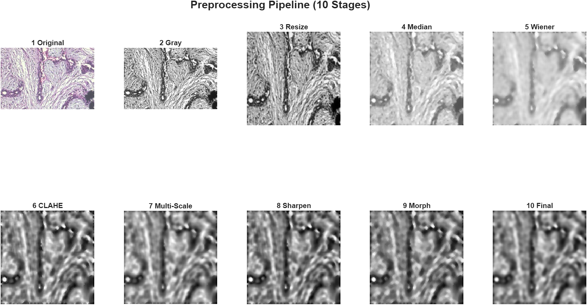

</td>
<td width="50%">

**02. LDA 1D Projection**
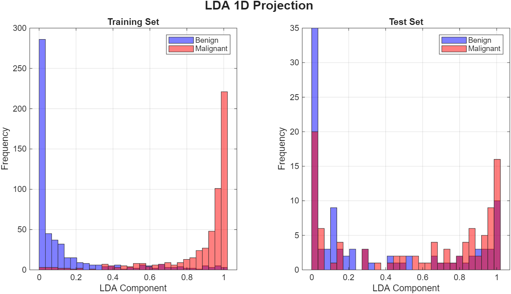

</td>
</tr>

<tr>
<td>

**04. Feature Selection Algorithm Comparison**
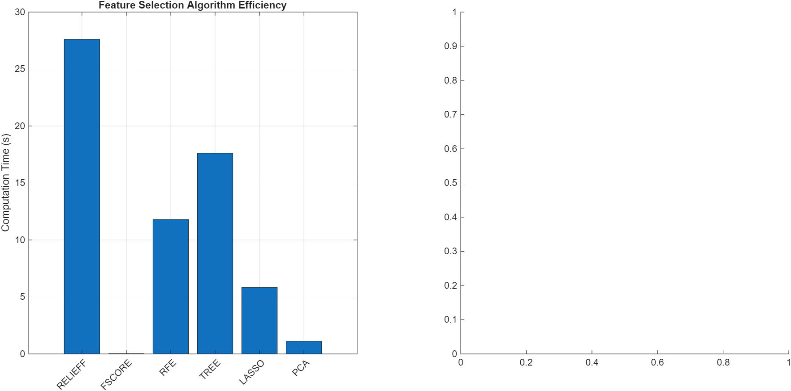

</td>
<td>

**05. PCA Analysis**
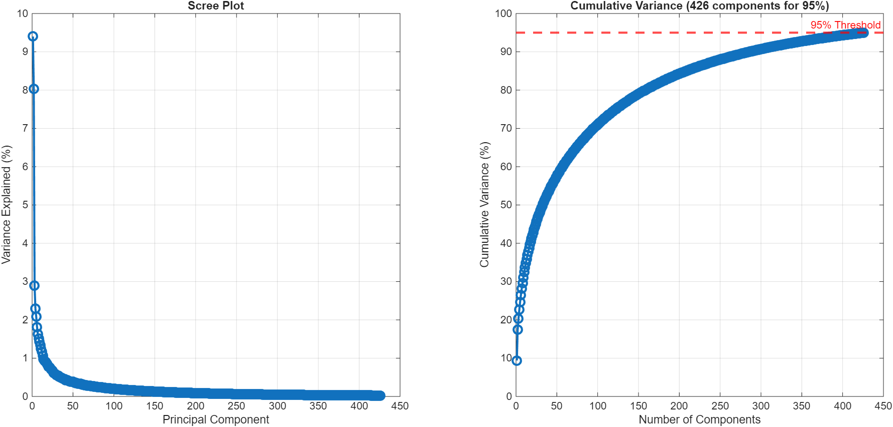

</td>
</tr>

<tr>
<td colspan="2">

**06. Hyperparameter Tuning Curves**
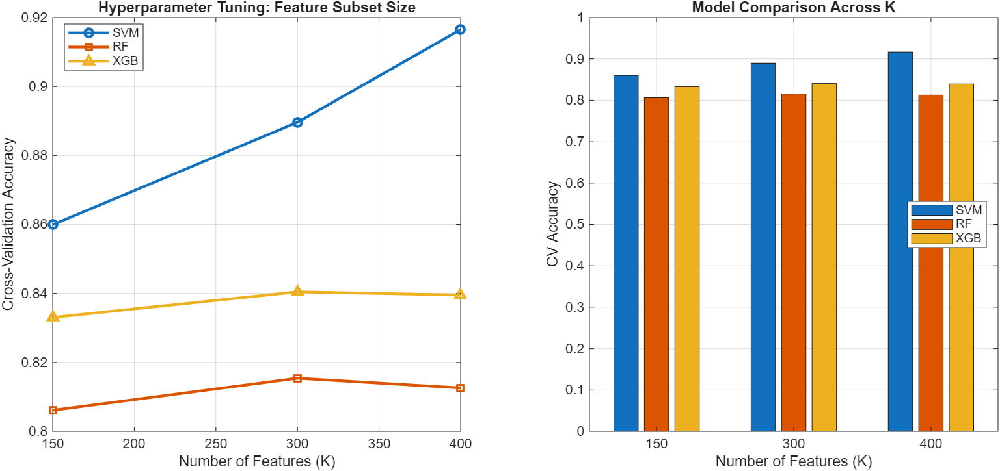

</td>
</tr>

<tr>
<td>

**07. SVM Performance**
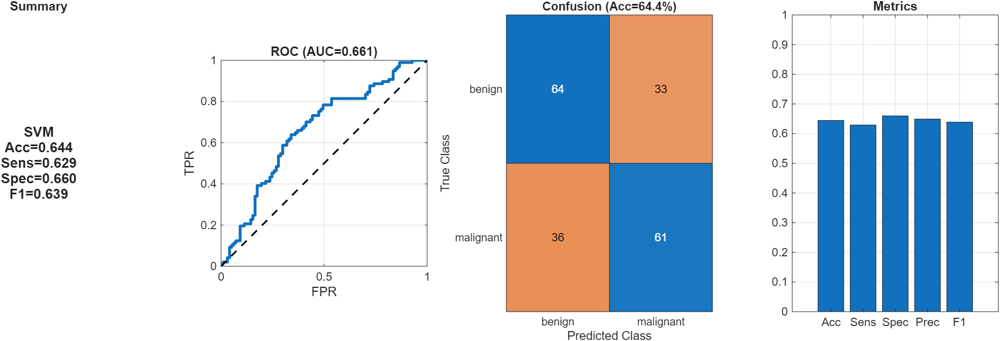

</td>
<td>

**08. Random Forest Performance**
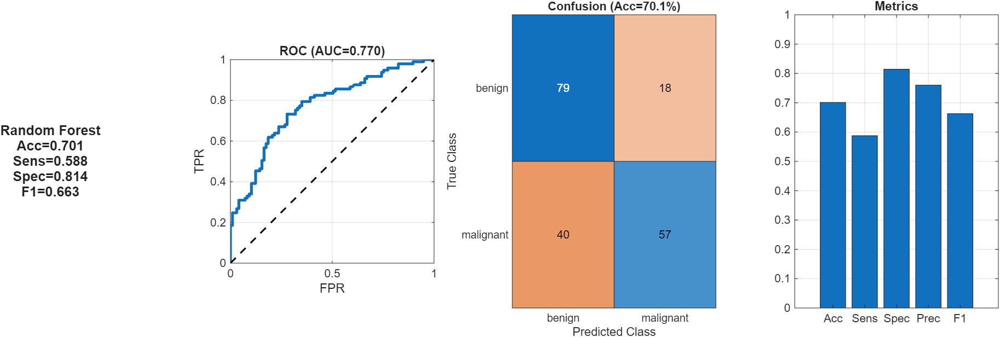

</td>
</tr>

<tr>
<td>

**09. XGBoost Performance**
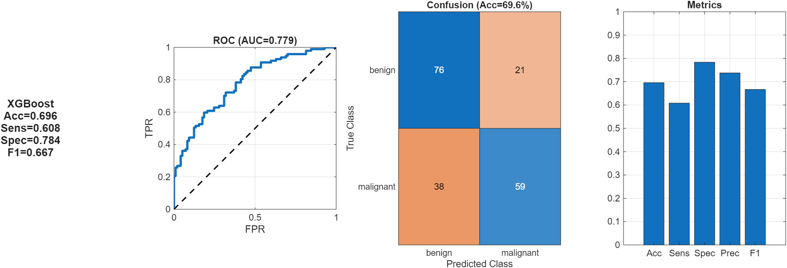

</td>
<td>

**10. Metrics Comparison**
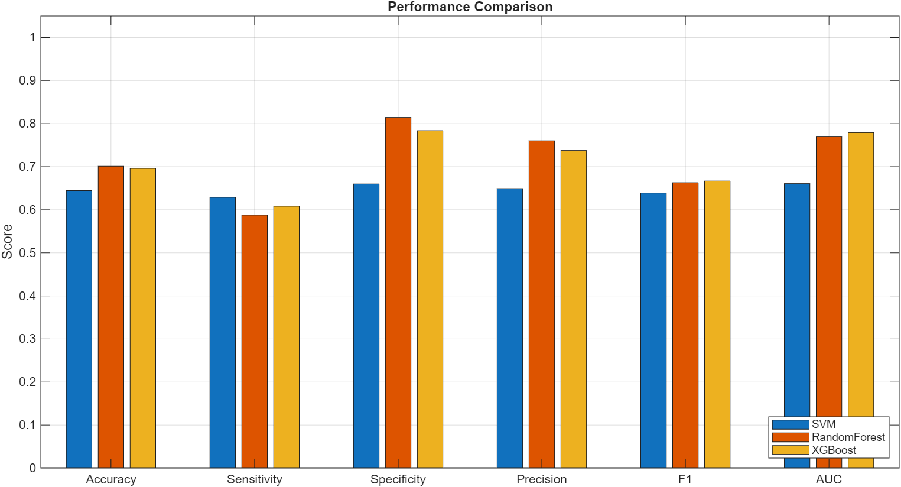

</td>
</tr>

<tr>
<td>

**11. Combined ROC Curves**
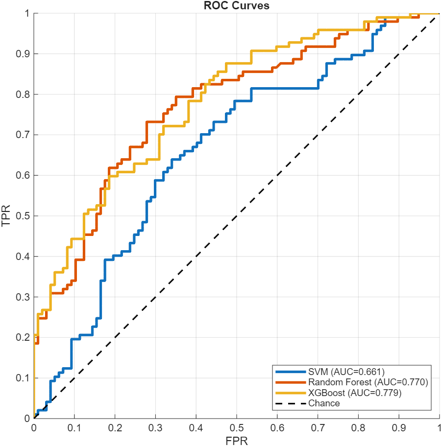

</td>
<td>

**12. Confusion Breakdown (TN/FP/FN/TP)**
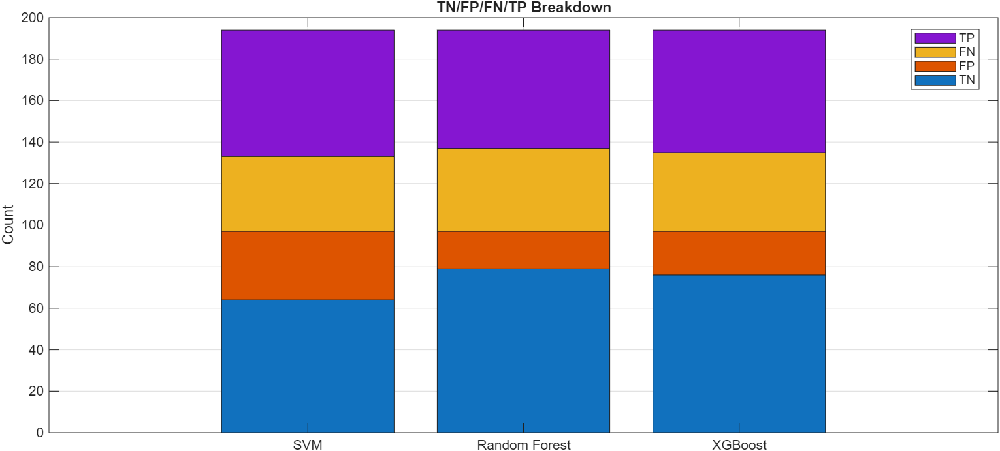

</td>
</tr>

<tr>
<td colspan="2">

**13. Confusion Matrices (All Models)**
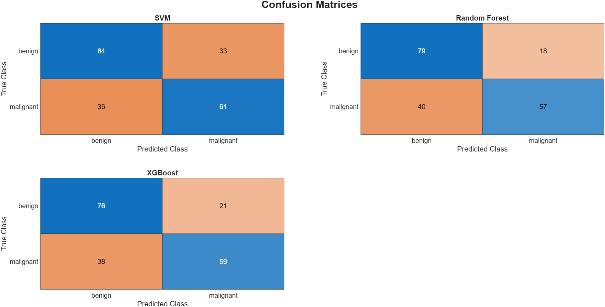

</td>
</tr>
</table>

---

## 📄 License

This project is licensed under the **MIT License** - see the [LICENSE](LICENSE) file for details.

**BreakHis Dataset License:**  
Publicly available for research purposes. Please cite the original paper (Spanhol et al., 2016) when using the dataset.

---

## 👨‍💻 Author

**Mohamed Mohamed Said Aly and Wei Chun**  
*Expert in Generative AI, NLP, Deep Learning and Machine Learning*

### Contact
- GitHub: [@msaid1976](https://github.com/msaid1976) & [@stevelohwc](https://github.com/stevelohwc)   
- LinkedIn: [Mohamed Said Aly](https://www.linkedin.com/in/mohamedsaidaly) & [Loh Wei Chun](https://www.linkedin.com/in/weichn)   

---

## 🙏 Acknowledgments

- **BreakHis Dataset**: Spanhol et al. for providing the publicly available dataset
- **MATLAB**: MathWorks for comprehensive image processing and ML toolboxes
- **Medical Community**: Domain experts for guidance on clinical validation

---

## 📊 Project Status

🟢 **Status**: Complete & Functional  
🎯 **Achievement**: End-to-end automated pipeline with GUI  
📅 **Last Updated**: January 2025  
🔄 **Version**: 1.0.0  

---

## 🤝 Contributing

Contributions welcome! Areas of interest:
- Deep learning implementation (CNN architectures)
- Multi-magnification fusion strategies
- Advanced preprocessing techniques


**To contribute:**
1. Fork the repository
2. Create your feature branch (`git checkout -b feature/Enhancement`)
3. Commit changes (`git commit -m 'Add Enhancement'`)
4. Push to branch (`git push origin feature/Enhancement`)
5. Open a Pull Request

---

**⭐ If you find this project useful, please consider giving it a star!**

**📧 Questions? Open an issue or reach out.**
